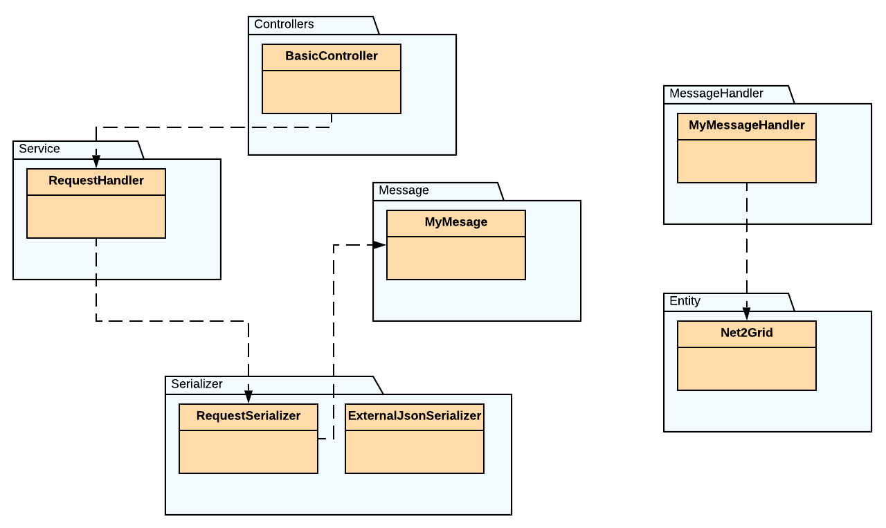

# Application's Internals
This section provides an extensive look at application's classes
and how these are combined together to provide the desired functionality.

|  | 
|:--:| 
| *Depedencies between classes* |  

 

## Producing Messages
In order to produce and publish messages to the queue, the following process is necessary.

{: style="height:10%;width:95%; margin-left:1%"}

Several classes are involved in the process:

### BasicController

{: style="height:10%;width:30%;margin-left:1%"}

BasicController exposes an endpoint at `/basic/{num_of_messages: int}`{style="color:#EA6113;"}. Each time a request to this endpoint occurs, Symfony
makes sure that BasicController.index() is invoked. There, the controller uses the requestHandler->sendRequest() function, in order to receive a message (type of array) and a rooting key (type of string). The requestHandler is a `RequestHandler`{style="color:#EA6113;"} instance. Then, controller uses the function dispatch(), provided by Symfony Messernger Component, in order to sent the message to the queue. The process is repeated for num_of_messages times. If num_of_messages is not specified, it is considered to be equal to 1.

### RequestHandler  

{: style="height:10%;width:30%;margin-left:1%"}

RequestHandler exposes a public method named sendRequest. Each time sendRequest() is invoked, a `GET`{style="color:#EA6113;"} request is sent at `https://a831bqiv1d.execute-api.eu-west-1.amazonaws.com/dev/results`{style="color:#EA6113;"}. The response is forwarded to a `RequestSerializer`{style="color:#EA6113;"} instance, in order to construct
a message object, type of `MyMessage`{style="color:#EA6113;"} and a rooting key, type of string. Both the message and the rooting key are
returned as function's result, to `BasicController`{style="color:#EA6113;"}.

### RequestSerializer

{: style="height:10%;width:35%;margin-left:1%"}

RequestSerializer is responsible for de-serialization of responses, received by `RequestHandler`{style="color:#EA6113;"}. Each response
has the following format:

    {
        gatewayEui:     string,
        profileId:      string,
        endpointId:     string,
        clusterId:      string,
        attributeId:    string,
        value:          int,
        timestamp:      int        
    }

The `RequestSerializer`{style="color:#EA6113;"} will turn such a response into a `message: MyMessage`{style="color:#EA6113;"} instance and a `rooting key: string`{style="color:#EA6113;"}.  
The rooting key has the form: `<gateway eui>.<profile>.<endpoint>.<cluster>.<attribute>`{style="color:#EA6113;"} and is created by the decimal value of the corresponding values in respone object. The convertion from string to decimal is achieved using the
php build-in function hex2dec_string.

### MyMessage

{: style="height:10%;width:25%;margin-left:1%"}

MyMessage is a common php class which defines the data that each queue message contains.
MyMessage has the following attributes:

* value `int`{style="color:#EA6113;"}
* timestamp  `int`{style="color:#EA6113;"}
* rootingKey  `string`{style="color:#EA6113;"}

In our messenger.yaml file, we have already defined that `MyMessage`{style="color:#EA6113;"} class will be used for rooting by
our tranports. Thus, Symfony Component Messenger knows that it should sent a `MyMessage`{style="color:#EA6113;"} object
to the queue. Additionally, when consuming a message type of `MyMessage`{style="color:#EA6113;"}, it tries to invoke
a proper handler function.

## Consuming Messages
In order to consume messages from the queue we need a properly defined class. This class should
implement the `Symfony\Component\Messenger\Handler\MessageHandlerInterface`{style="color:#EA6113;"}. In this application the
corresponding class is named `MyMessageHandler`{style="color:#EA6113;"}.

{: style="height:10%;width:95%; margin-left:1%"}

### MyMessageHandler

{: style="height:10%;width:30%;margin-left:1%"}

MyMessageHandler is a class that implements `Symfony\Component\Messenger\Handler\MessageHandlerInterface`{style="color:#EA6113;"}.
Here we override the \__invoke(MyMessage $msg), in order to define how to handle
a message each time it is consumed. In our cases, a consumed message's attributes are used in order to create a `Net2Grid`{style="color:#EA6113;"} object, which allows us to store those data in the database.

<!-- 

Note that all we need to do, is declare that the \__invoke function accepts as argument a MyMessage object. This way the Symfony Messenger Component knows to use this specific handler each time a message arrives in the Bus, in order to be consumed.

   -->
!!! note
    Note that all we need to do, is declare that the \__invoke function accepts as argument a `MyMessage`{style="color:#7B0DAE;"} object. This way the Symfony Messenger Component knows to use this specific handler each time a message arrives in the Bus, in order to be consumed.

### Net2Grid

{: style="height:10%;width:22%;margin-left:1%"}

Net2Grid is a doctrine ORM Entity used to easily save data to the database. The Entity
has the following attributes:

* id            `ID`{style="color:#EA6113;"}
* gatewayEui    `STRING`{style="color:#EA6113;"}
* profile       `STRING`{style="color:#EA6113;"}
* endpoint      `STRING`{style="color:#EA6113;"}
* cluster       `STRING`{style="color:#EA6113;"}
* attribute     `STRING`{style="color:#EA6113;"}
* value         `BIGINT`{style="color:#EA6113;"}
* timestamp     `BIGINT`{style="color:#EA6113;"}

## Declaring Additional Services
Since `BasicController`{style="color:#EA6113;"} uses an instance type of`RequestHandler`{style="color:#EA6113;"} and `RequestHandler`{style="color:#EA6113;"}
uses an instance type of `RequestSerializer`{style="color:#EA6113;"}, we should add the following lines in
our services.yaml file.

    # add more service definitions when explicit configuration is needed
    App\Controller\BasicController: ['@App\Service\RequestHandler']
    App\Service\RequestHandler: ['@App\Serializer\RequestSerializer']

## Commands - An alternative way to Produce messages
Symfony framework allows us to define custom commands, which can be later executed using:
    
    php bin/console app:command-name

In this project we define such a Command, named `produce-messages`{style="color:#EA6113;"}.

{: style="height:10%;width:35%;margin-left:1%"}

The `produce-messages`{style="color:#EA6113;"} is defined in the `ProduceMessageCommand` file and is
being used as an alternative way to produce messages. The command uses the exact same code as [Basic Controller](internals.md#basiccontroller). The only difference is that we do no longer need to visit a url to create new messages. The number of produced messages can be defined using the `--messages` option, which has a default value of 20. Here is an example of the `produce-messages`{style="color:#EA6113;"} usage:

    php bin/console app:produce-messages --messages=60