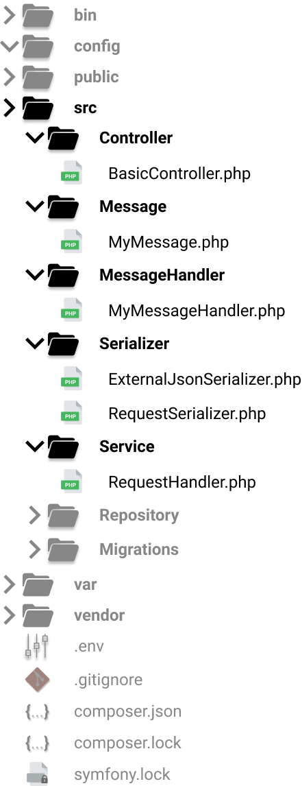
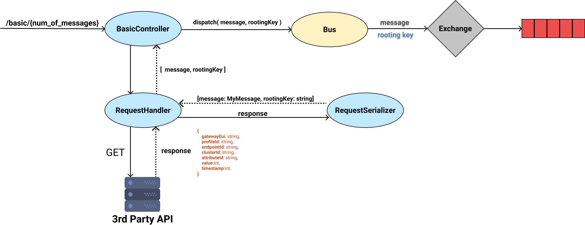
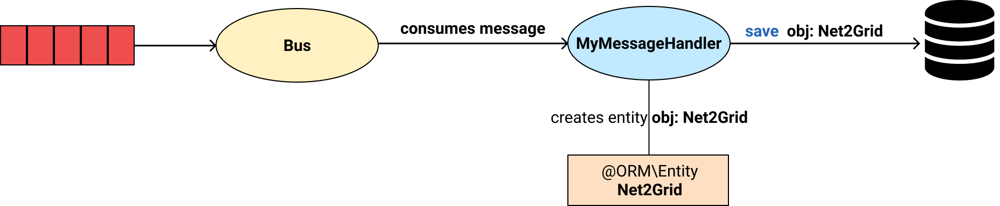

# The Big Picture
This section provides an extensive look at application's classes
and how these are combined together to provide the desired functionality.

## Project Structure
The figure bellow shows part of the project structure, which contains several new classes.
Each class has a specific responsibility, e.g. consuming data from an API, serializing the data,
creating messages, etc. More details are provided later in this section.

{: style="height:10%;width:30%;margin-left:5%"}

## Producing Messages
In order to produce and publish messages to the queue, the following process is necessary.

{: style="height:10%;width:90%; margin-left:1%"}

Several classes are involved in the process:

### BasicController  
Exposes an endpoint at `/basic/{num_of_messages: int}`. Each time a request to this endpoint occurs, Symfony
makes sure that BasicController.index() is invoked. There, the controller uses the requestHandler->sendRequest() function, in order to receive a message (type of array) and a rooting key (type of string). The requestHandler is a `RequestHandler` instance. Then, controller uses the function dispatch(), provided by Symfony Messernger Component, in order to sent the message to the queue.

### RequestHandler  
Exposes a public method named sendRequest. Each time sendRequest() is invoked, a `GET`request is send at `https://a831bqiv1d.execute-api.eu-west-1.amazonaws.com/dev/results`. The response is forwarded to a `RequestSerializer` instance, in order to construct
a message object, type of `MyMessage` and a rooting key, type of string. Both the message and the rooting key are
returned as function's result, to `BasicController`.

### RequestSerializer
Is responsible for de-serialization of responses, received by `RequestHandler`. Each response
has the following format:

    {
        gatewayEui:     string,
        profileId:      string,
        endpointId:     string,
        clusterId:      string,
        attributeId:    string,
        value:          int,
        timestamp:      int        
    }

The `RequestSerializer` will turn such a response into a `message: MyMessage` instance and a `rooting key: string`.  
The rooting key has the form: `<gateway eui>.<profile>.<endpoint>.<cluster>.<attribute>` and is created by the decimal value of the corresponding values in respone object. The convertion from string to decimal is achieved using the
php build-in function hex2dec_string.

### MyMessage
A common php class which defines the data that each queue message contains.
MyMessage has the following attributes:

* value `int`
* timestamp  `int`
* rootingKey  `string`

In our messenger.yaml file, we have already defined that `MyMessage` class will be used for rooting by
our tranports. Thus, Symfony Component Messenger knows that it should sent a `MyMessage` object
to the queue. Additionally, when consuming a message type of `MyMessage`, it tries to invoke
a proper handler function.

## Consuming Messages
In order to consume messages from the queue we need a properly defined class. This class should
implement the `Symfony\Component\Messenger\Handler\MessageHandlerInterface`. In this application the
corresponding class is named `MyMessageHandler`.

{: style="height:10%;width:95%; margin-left:1%"}

### MyMessageHandler
A class that implements `Symfony\Component\Messenger\Handler\MessageHandlerInterface`.
Here we override the \__invoke(MyMessage $msg), in order to define how to handle
a message each time it is consumed. In our cases, a consumed message's attributes are used in order to create a `Net2Grid` object, which allows us to store those data in the database.

<!-- 

Note that all we need to do, is declare that the \__invoke function accepts as argument a MyMessage object. This way the Symfony Messenger Component knows to use this specific handler each time a message arrives in the Bus, in order to be consumed.

   -->
!!! note
    Note that all we need to do, is declare that the \__invoke function accepts as argument a MyMessage object. This way the Symfony Messenger Component knows to use this specific handler each time a message arrives in the Bus, in order to be consumed.

### Net2Grid
This is a doctrine ORM Entity used to easily save data to the database. The Entity
has the following attributes:

* id        `ID`
* gatewaiUi `STRING`
* profile   `STRING`
* endpoint  `STRING`
* cluster   `STRING`
* attribute `STRING`
* value     `BIGINT`
* timestamp `BIGINT`

## Declaring Additional Services
Since `BasicController` uses an instance type of`RequestHandler` and `RequestHandler`
uses an instance type of `RequestSerializer`, we should add the following lines in
our services.yaml file.

    # add more service definitions when explicit configuration is needed
    App\Controller\BasicController: ['@App\Service\RequestHandler']
    App\Service\RequestHandler: ['@App\Serializer\RequestSerializer']
