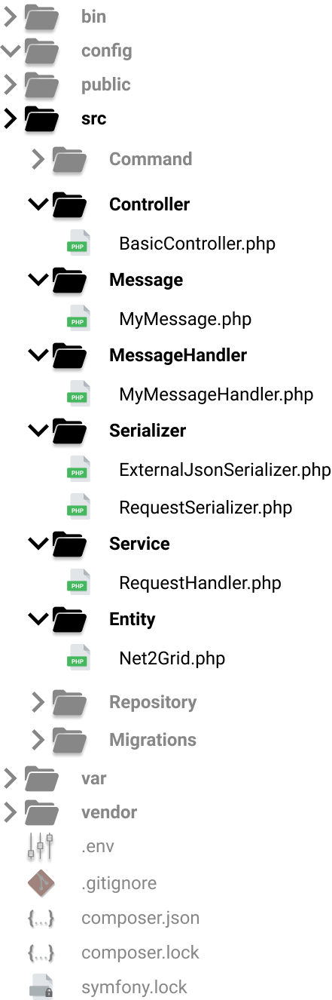

# Project Structure
The following figure shows part of the project structure, which contains several new classes.
Each class has a specific responsibility, e.g. consuming data from an API, serializing the data,
creating messages, etc. More details about the specific use of each class is provided in section [Application's Internals](internals.md). In this section we discuss about the functionality and the porpuse of classes inside
these directories. Each directory under the src/ is used to define a group of classes, which have common functionality.

{: style="height:10%;width:30%;margin-left:5%"}

## Controller

This directory contains classes that act as controllers. This directory contains classes that act as controllers. Controllers are used to decoupling classes and increase reusability. In Symfony, each controller may contain several methods bound to different endpoints, using annotations, which handle requests to the corresponding endpoints.

## Message

This directory contains classes that define the form of the messages, that will be sent to and received from the queue.

## MessageHandler

This directory contains classes whose purpose is to define how consumed messages will be handled. In order to achieve such behavior, each class must implements the `Symfony\Component\Messenger\Handler\MessageHandlerInterface`
and thus, it must override the \__invoke method. Each class in this directory is bound to a class under Message directory. Defining such a binding in Symfony 4 is really easy, since it is defined by the type of the argument provided in the \__invoke function.

## Serializer

This directory contains classes that are used for abstracting the serialization, or de-serialization, of json objects, arrays, php objects, etc.

## Service

This directory contains classes which provide a specific and reusable functionality. 

## Entity

This directory contains classes that represent Doctrine entities and are used for easying integration with the database.

## Repository

This directory is auto-updated by Doctrine.

## Migrations

This directory is auto-updated by Doctrine. It contains migrations which can be used to update the database without
using raw sql queries.

